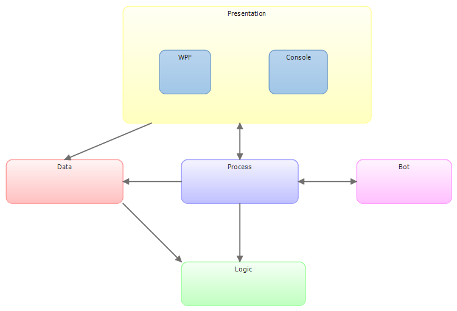

Jeu de Barricade
================
Dit bordspel is een schoolopdracht gemaakt door Tim Slot en Nanne Wielinga in maart en april van 2013. Het spel heet Jeu de Barricade en is een variatie op Mens-erger-je-niet.

Techniek
--------
Het project is gebouwd in C# en heeft een WPF interface. Dankzij de architectuur zal het omzetten naar een andere interface gemakkelijk zijn. Ook het inbouwen van een netwerklaag is simpel.

Architectuur
------------
Ter ondersteuning van de ontwikkeling is de architectuur beschreven en te vinden in het bestand [Architectuur.pdf](Architectuur.pdf). Verder valt de code opgedeeld in namespaces te vinden in het "Barricade"-project. Daarnaast is er een console-applicatie waarin bots zelf spelen.

Zoals hierboven is te zien wordt het bordspel opgedeeld in verschillende namespaces.

Functionaliteit
---------------

*   Twee standaard levels (kort en lang) 
*   Eigen levels laden
*   Tijdens het spelen levels opslaan
*   Met meerdere mensen of tegen computer spelen
*   Drie verschillende bot-strategieën (vriendelijk, rusher en willekeurig)
*   Animaties bij pion-verplaatsingen
*   Beïnvloedbare dobbelsteen en beurt
